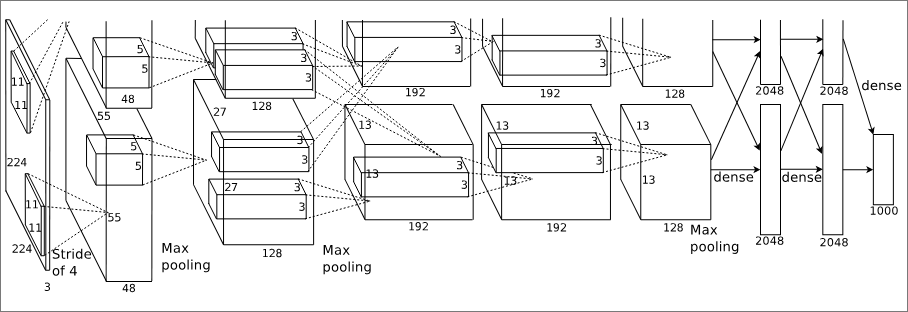

# Introduction
- This paper is one of the fundamental papers that initialised the AI growth in popularity in the present.
- It looked to improve on the image classification using a Neural Network, which at the time was not a very popular approach due to its difficulty in optimisation.
- They talk about how many of the datasets used in benchmarking are very small compared to what would be needed
- Instead of small datasets like CIFAR of NORB, they are interested in working with millions of images and thousands of categories to improve image recognition in the real world - this uses images from the real world with real world noise
- They chose CNNs over feed forward NNs because they are easier to train on image datasets
- Their model achieved the best results on the ImageNet dataset yet --- they have a publicly available gpu implementation of a 2d cnn on top of page 1 (use for repeating exp)
- Their final model was made of five convolutional and three fully-connected layers (combining CNN and feed forward networks)
- They took between five to six days to train the model on two GTX 580 3GB GPUs 
# The Dataset
- Since their model only took one dimension of inputs, the images had to all be the same resolution
- In the case of high resolution images they down scaled them to a standard 256x256 image. For a rectangular image, they had to downscale so the shorter side would be 256 and then cropped out the edges to make a 256x256 image
- The model performance is also measured using top-1 and top-5 (weather the model considers the actual category in the top 1 or top 5 categories for a given image)
# The Architecture
## ReLU Nonlinearity
- They used the ReLU activation function to optimise the network.
- They go on to explain that using ReLU is around six times faster than the tanh function at optimisation
- The other functions mentioned were tanh and also f(x) = |tanh(x)| which introduced non linear functions
## Training on Multiple GPUs
- They only had access to GTX 580s at the time so they had to train the model on two of them since one didn't have enough memory to train the model
- They used a type of parallelisation where each GPU contained half the kernels of the network but each layer of kernels only had access to certain amount of kernels in the other GPU
- I don't really understand this but they say it all allowed them the precisely tune the amount of communication until it's an acceptable fraction of the amount of computation (???)
- Ok, I figured it out, basically they only let some of the layers to access all the layer maps on both GPUs but other layers can only access layer maps on one GPU so it is computationally less expensive :)
- This communication improved they error rates by 1.7% and 1.2%
## Local Response Normalisation
- Hyperparameters set are: 
$$
k=2; n=5; \alpha = 10^{-4}; \beta = 0.75
$$
- remember these for experiment reconstruction
## Overlapping Pooling
- They used overlapping pooling layers which means pooling units are allowed to share pixels in the image, they are not mutually exclusive to one pooling unit![[Pasted image 20260629214559.png|438]]
- This reduced the top-1 and top-5 error rates by 0.4% and 0.3% respectively
## Overall Architecture
- Eight weighted layers: five convolutional, three full-connected layers
- Final layer is fed into a 1000-way softmax a prediction probability for each of the 1000 possible labels for a given input
- Kernels of the $2^{nd}$, $4^{th}$ and $5^{th}$ convolutional layers are connected the the kernel maps in the previous layer on the same GPU
- The kernel on the $3^{rd}$ layer are connected to all kernel maps in the $2^{nd}$ 
- All the full-connected layers are connected to all neurons in the previous layer
- [[#Local Response Normalisation|Response Normalisation]]  come after the first and second convolutional layers
- Max-pooling layers come aftter the response normalization layer and the fifth convoultional layer

- First conv. layer filters 225x224x3 with 96 kernels of size 11x11x3 with stride of 4 pixels
- Second conv. layer has 256 kernels of size 5x5x48
- Third conv. layer has 384 kernels of size 3x3x256
- Fourth conv. layer has 384 kernels of size 3x3x192
- Fifth conv. layer has 256 kernels of size 3x3x192
- All fully-connected layers have 4096 neurons each